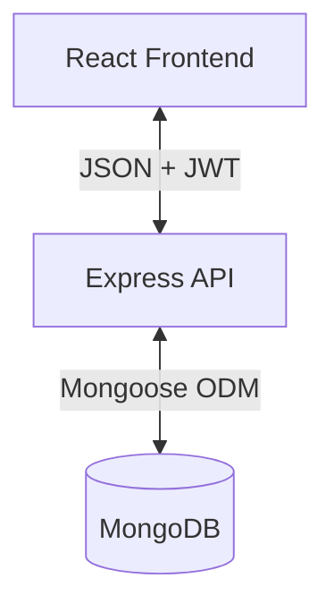
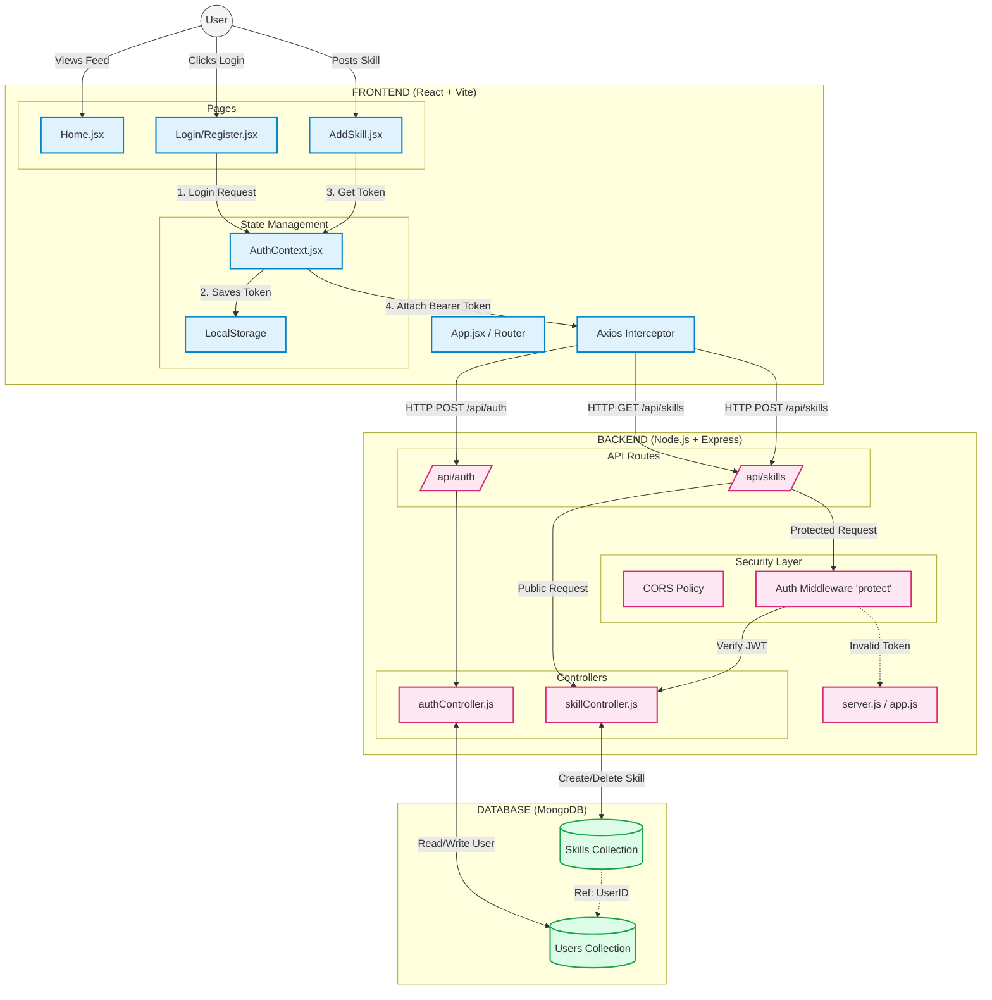

<p align="center">
  
</p>

#  SkillSwap - Neighborhood Skill Exchange Platform


> **"Time is the new currency."**

SkillSwap is a community-driven web platform where neighbors exchange skills (tutoring, repairs, tech support) using **Time Credits** instead of money. If you give 1 hour of help, you earn 1 Time Credit to receive help later.

---

## 🌟 Key Features

### 🔐 Authentication & Security
- **Secure Registration/Login:** Powered by JWT (JSON Web Tokens) and Bcrypt hashing  
- **Protected Routes:** Only authenticated users can access specific features  
- **Session Persistence:** Automatic login via LocalStorage  

### 📋 Skill Management
- **Post a Skill:** Offer services (Title, Description, Category, Location)  
- **Smart Dashboard:** View Time Credits, Location, and Reputation stats  
- **Ownership Control:** Users can delete only their own listings  
- **Dynamic Feed:** Real-time fetching of community skills  

### 🎨 User Interface
- **Modern Design:** Built with **Tailwind CSS**  
- **Visual Feedback:** Loading states, error handling, toast notifications  
- **Iconography:** Beautiful icons via Lucide-React  

---

## 🏗️ Architecture

### High-Level Overview


### Detailed System Diagram


---

## 📂 Folder Structure
```
/skill-exchange-platform
│
├── /client          # Frontend (React + Vite + Tailwind)
│   └── /src
│       ├── /components   # Reusable UI
│       ├── /context      # AuthContext (Global State)
│       └── /pages        # Views (Home, Login, AddSkill)
│
└── /server          # Backend (Node + Express)
    ├── /config      # DB Connection
    ├── /controllers # Business Logic
    ├── /middleware  # Auth Protection
    ├── /models      # Mongoose Schemas
    └── /routes      # API Endpoints
```

---

## 🚀 Tech Stack

### Frontend
- React (Vite)  
- Tailwind CSS  
- Axios  
- React Router DOM  
- Lucide Icons  

### Backend
- Node.js + Express  
- MongoDB (Mongoose)  
- JWT & Bcrypt  
- CORS  

---

## 🛠️ Getting Started

### Prerequisites
- Node.js (v14+)  
- MongoDB (Local or Atlas)  
- Git  

### 1️⃣ Clone the Repository
```bash
git clone https://github.com/YOUR_USERNAME/skill-exchange.git
cd skill-exchange
```

### 2️⃣ Backend Setup
```bash
cd server
npm install
```

Create a `.env` file inside `/server`:

```env
PORT=5000
MONGO_URI=mongodb://127.0.0.1:27017/skill-exchange
JWT_SECRET=your_super_secret_key_123
```

Run the backend:
```bash
npm run dev
```

### 3️⃣ Frontend Setup
```bash
cd ../client
npm install
npm run dev
```

Open:
```
http://localhost:5173
```

---

## 🔌 API Endpoints

| Method | Endpoint | Description | Access |
|-------|----------|-------------|--------|
| POST | /api/auth/register | Register a new user | Public |
| POST | /api/auth/login | Login user & get token | Public |
| GET | /api/skills | Get all skills | Public |
| POST | /api/skills | Create new skill | Private |
| DELETE | /api/skills/:id | Delete skill | Private (Owner) |

---

## 🤝 Open for Collaboration
We welcome contributions — help us add new features!

---

## 💡 How to Contribute
1. Fork the repo  
2. Create a branch:  
   ```bash
   git checkout -b feature/AmazingFeature
   ```
3. Commit:
   ```bash
   git commit -m "Add AmazingFeature"
   ```
4. Push & open a Pull Request  

---

## 📜 License
Distributed under the MIT License.

---

## 📬 Contact
**Project Maintainer:** Aditya Kumar  
**Email:** kumarsinghaditya240@gmail.com
